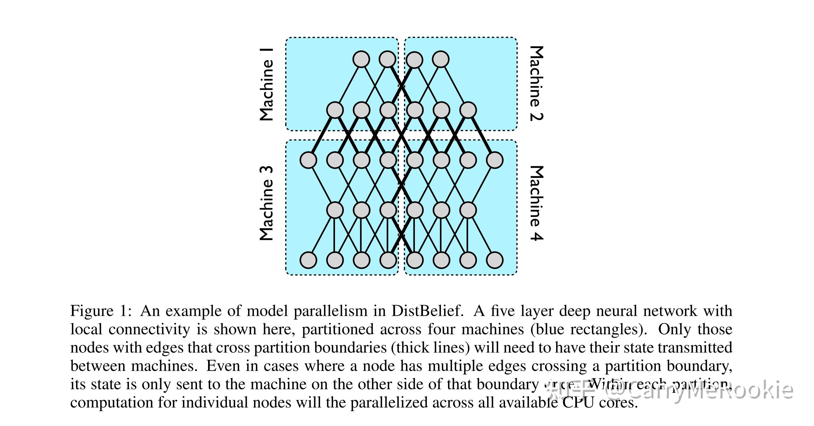
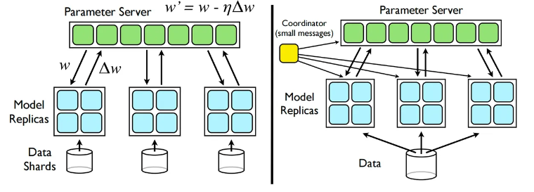
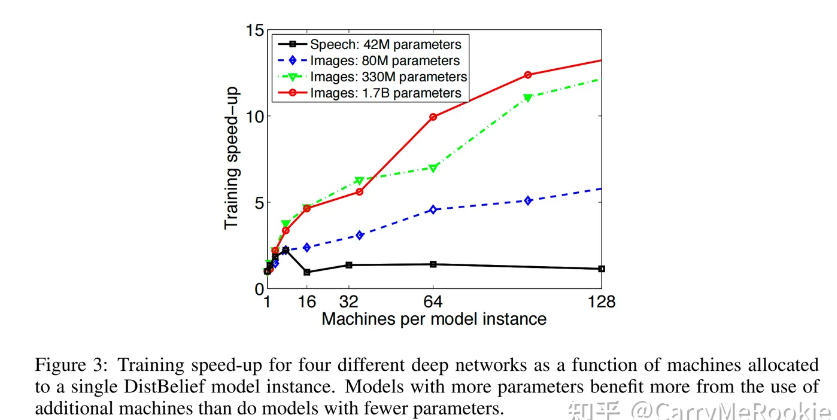

# 2012 google: Large Scale Distributed Deep Networks

**个人总结**

并行思想：

1. 通过[model](https://so.csdn.net/so/search?q=model&spm=1001.2101.3001.7020) parallel实现多个machine训练单个模型，见图一

2. 异步训练不同的数据集

   数据集分为不同部分，在模型副本中训练，最后到一个服务器中进行异步同步。加入了时间戳，有些参数会过期（其他模型副本对某些参数进行更新）

创新点：

异步，

参照mapreduce思想有备份以及调度策略（快机器多干，坏节点任务重新分配）

😀😀😀😀😀😀😀😀😀😀😀😀😀😀

**论文内容**

论文时间 2012

## 摘要

背景：数万cpu训练数十亿

贡献：

1. 开发DistBelief框架
2. Downpour SGD 随机梯度下降 异步更新参数
3. Sandblaster 分布式批量优化

## 介绍

DistBelief的软件框架，它可以在一台机器内部（通过多线程）和跨机器（通过消息传递）实现模型并行，而并行性、同步和通信的细节由框架管理。

支持模型并行和数据并行

## 相关工作

MapReduce，设计用于并行数据处理，不适合深度网络训练中固有的迭代计算；而GraphLab，设计用于一般（无结构）图计算，不会利用在深度网络中通常找到的结构图中可用的计算效率

## 模型并行

在这个分布式设置中，只有那些跨越机器边界的节点（用粗线表示）需要在不同机器间传输状态。**即使一个节点有多条边跨越边界，它的状态只发送一次到那个边界的另一侧的机器**。在每个分区内，各个节点的计算会在所有可用的CPU核心上并行执行。

具有大量参数或高计算需求的模型通常会从访问更多的CPU和内存中受益，直到通信成本占主导地位

## 分布式优化算法

集中式分片参数服务器

- **Downpour SGD**：在这种方法中，多个模型副本异步地从参数服务器获取参数 *w* 并将梯度 Δ*w* 推送回参数服务器。这意味着每个副本都独立地工作，更新参数并将这些更新发送回服务器，而不需要与其他副本同步。
- **Sandblaster L-BFGS**：这种方法由一个“协调器”控制，它向副本和参数服务器发送小消息来指导批量优化。这里的重点是更紧密的控制和协调，其中协调器负责管理整个优化过程，确保所有副本和服务器之间的有效通信。

### Downpour SGD

SGD的传统形式本质上是顺序的，使得它不适用于非常大的数据集，因为以完全串行的方式遍历数据所需的时间是禁止的。

Downpour SGD，一种使用单个DistBelief模型的多个副本的异步随机梯度下降的变体

将训练数据划分为多个子集，并在每个子集上运行模型的一个副本。模型通过集中式参数服务器进行更新通信，该服务器保持模型所有参数的当前状态，这些参数分布在许多机器上（例如，如果我们有10个参数服务器分片，每个分片负责存储和应用更新到模型参数的1/10）

### Sandblaster L-BFGS

Sandblaster的一个关键思想是分布式参数存储和操作

优化算法的核心（例如L-BFGS）位于协调器进程中（图2），该进程无法直接访问模型参数。相反，协调器发出一小组操作命令（例如，点积，缩放，系数加法，乘法），每个参数服务器分片都可以独立执行这些操作，结果存储在同一分片上。额外的信息，例如L-BFGS的历史缓存，也存储在计算它的参数服务器分片上。这允许运行大型模型（数十亿个参数），而无需将所有参数和梯度发送到单个中心服务器。

协调器为N个模型副本中的每一个分配一小部分工作，这比批量总大小的 1/Ntℎ 小得多，并在副本空闲时为副本分配新的部分。通过这种方法，更快的模型副本比较慢的副本做更多的工作

## 实验

## 总结

发现了几种有效的分布式优化策略。我们发现Downpour SGD，一个高度异步的SGD变体，对于训练非凸的深度学习模型表现出惊人的好效果。Sandblaster L-BFGS，一个L-BFGS的分布式实现，可以与SGD相媲美，而且它更有效地利用网络带宽，使其可以扩展到更大数量的并行核心来训练单个模型。

### 限制

我们的模型并行化方法在全连接网络的内存和计算需求上都有限制。此外，由于全连接网络中每个节点都需要与所有其他节点通信，所以网络开销也可能成为问题。尽管我们的框架可以使用诸如模型副本间的延迟更新等技术来缓解这些问题，但对于极大的网络，我们可能需要进一步研究更高效的并行化策略，以解决计算和通信瓶颈。

