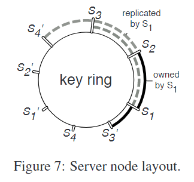

# Scaling Distributed Machine Learning with the Parameter Server

**个人总结**

李沐，**大规模分布式系统架构**——参数服务器（Parameter Server）第三代

异步通信，灵活一致性，容灾

太超前了

**论文内容**

论文时间2014

## 摘要

提出了一个用于分布式机器学习问题的参数服务器框架。数据和工作负载被分布在工作节点上，而服务器节点维护着全局共享的参数

## 介绍

### 当前问题

单个机器不再适合大规模

训练数据量较大

共享带来的挑战：

​	网络通讯

​	全局同步影响性能

​	容灾

​		大规模训练任务越大失败率越高

### 贡献

高效通信

灵活的一致性模型：参数可能会过时

弹性可扩展性：训练时加机器

容灾：1s内，向量钟

易用

### 工程挑战

参数节点，计算节点

通信：发送片段（矩阵某行，向量片段）

容错：

### 相关工作

Yahoo,第一代

Distbelief，第二代，针对深度学习

本论文，第三代，针对机器学习

## 机器学习

梯度下降分布式实现

​	调度器

​	工作节点

​	参数服务器节点

## 架构

### kv向量

### 带区间的通讯接口

### 自定义函数更新梯度

### 异步调度与依赖

类似于进程调用后执行别的进程

有依赖就需要等待 

### 灵活一致性

可调节

### 自定义过滤器

某些参数没有更新太多，就不发送了

## 实现

### 向量钟

时间戳

### 通信

消息哈希值一样就省略

### 一致性哈希环

备份与管理

容错

### 服务器管理

通讯量降低与延迟的平衡

### 工作节点管理

## 评估

凸函数

