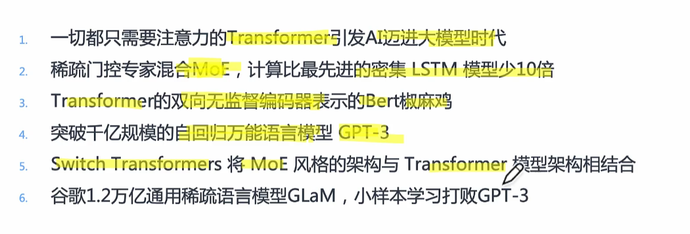

# 大模型训练

做一个集群->ai集群架构

集群需要通信->ai集群通信

研究大模型算法->有挑战->分布式训练

光有分布式训练的能力还不够，需要提升分布式训练的性能->分布式并行算法

并行算法混合在一起->大模型混合并行（华为可以自动混合并行

针对单机单卡进行内存和计算优化进一步使大模型训练的又快又好

## Foundation Model

2021年8月份，李飞飞和100多位学者联名发表一份200多页的研究报告《On the Opportunities and Risk of Foundation Models》，深度地综述了当前大规模预训练模型面临的机遇和挑战。从一开始的lenet、Alexnet、ResNet开始，模型参数一个比一个大，到了BERT网络模型的提出，使得参数量首次超过3亿规模，GPT-3模型超过百亿，鹏程盘古实现千亿稠密的规模、Switch Transformer的问世还一举突破万亿规模

### 模型碎片化，大模型提供预训练方案

### 大模型具备自监督学习功能，降低训练研发成本

### 大模型有望进一步突破现有模型结构的精度局限

### 大模型训练框架

目前部分深度学习框架，例如Pytorch和Tensorflow，没有办法满足超大规模模型训练的需求，于是微软基于Pytroch开发了DeepSpeed，腾讯基于Pytroch开发了派大星PatricStar，达摩院同基于Tensoflow开发的分布式框架Whale。像是华为昇腾的MindSpore、百度的PaddlePaddle，还有国内的一流科技OneFlow等厂商，对超大模型训练进行了深度的跟进与探索，基于原生的AI框架支持超大模型训练

## 从分布式训练到大模型训练

单机单卡，多级多卡

### 分布式训练：多台机器，每台机器多卡

#### 数据并行

数据并行，模型参数并行，梯度并行，优化器的状态并行

#### 模型并行

#### 流水线并行

吞吐量并不会到达预期，引入大模型训练技术

#### 混合并行

## 大模型训练的挑战

### 内存

动态内存，静态内存

### 通信

参数聚合同步更新还是异步更新

### 计算性能

算子层，图层，任务层

### 调优

## 多ai加速芯片训练大模型的主流方法

### 分布式并行加速

#### 数据并行

#### 模型并行

#### 流水线并行

#### 张量并行

### 算法模型架构

### 内存和计算优化

### 大模型训练的集群架构

#### 参数服务器模式（Parameter Server，PS）

1：

2：

这个时候百度基于PS架构之上提出了Ring-All-Reduce新的通讯架构方式

####  集合通讯模式（Collective Communication，CC）

## 大模型算法结构

